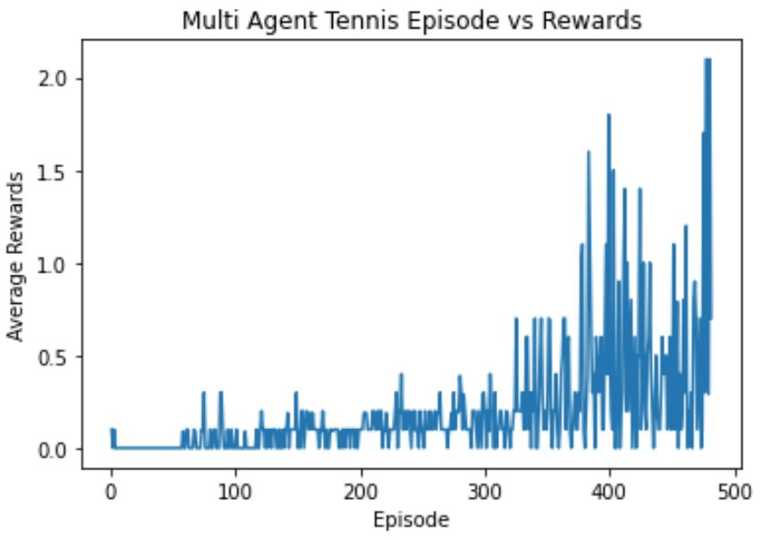

[//]: # (Image References)

[image1]: https://user-images.githubusercontent.com/10624937/42135623-e770e354-7d12-11e8-998d-29fc74429ca2.gif "Trained Agent"

# MADDPG - Tennis Multi Agent

### Introduction

To train a pair of reinforcement learning agent to play table tennis. This environment is simulated using Unity's Reacher Environment

![Trained Agent][image1]

### Project Details

1. Observation Space:
    - 8 variables corresponding to position, velocity of the ball, and racket.
2. Action Space:
    -  2 variables corrensponding to left right movement of racket, and jumping.
3. Rewarding Strategy:
    - if any agent hits the ball over the net, receive +0.1 as reward
    - if any agent  hits the ball out of bound or a ball hit the ground., receive -0.01 as reward
4. Solution Requirement:
    - score a minimum average of +0.5 over 100 consecuitive episodes.

### Implementation

1. Algorithm Approach: MADDPG
> This project is solved using Multi-Agent Deep Deterministic Policy Gradient (MADDPG) approach.
 - MADDPG supports output of continuous action space.
 - MADDPG is a extended version of DDPG with multiple agents.
 - MADDPG consists of multiple Agents and single Critic network.
 - Actor is a policy network that input states and output exact action value.
 - Critic is a Q-value network that output Q-value of the input of state action pair.

2. Hyper-Parameters:
> All parameters can be found in config.py. Most parameters refer to Official Published Paper: Continuous Control with Deep Reinforcement Learning
 - BATCH_SIZE: 128 #minibatch size of inputs 
 - BUFFER_SIZE: 1000000 #maximum buffer for replay buffer
 - GAMMA = 0.99 #discouunt rate for network
 - TAU = 0.01 #soft update of target network
 - LR_ACTOR = 0.0001 #learning rate of actor network
 - LR_CRITIC = 0.0003 #learning rate of critic network

### Results

This project is solved in 300 episodes exceeding average rewards of +0.5. Below shows the results of training process over the time.

### Futuee Work

1. To try out what will happen if we apply seperated critic network for each agent. 
